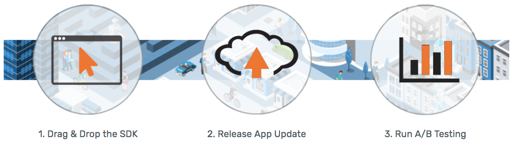

# Introduction

PacketZoom has been designed and engineered to be simple and straightforward. You can integrate the SDK into your app in minutes. No other changes to your app, to your infrastructure configuration are needed and there's no additional hardware to install or software to implement.

You always have full control over PZ Mobile Expresslane in your app through our dashboard where you'll be able to:

- Turn PacketZoom on/off without having to rebuild/redeploy your app
- Conduct A/B tests to see performance with/without PacketZoom
- Control what content goes through PacketZoom acceleration
- You'll have unprecedented operational monitoring and control to manage your app performance



# Getting Started
## Download SDK

The process begins with you downloading our SDK and including it into your application(s). The downloads can be accessed once you signup for a FREE Dashboard account [here](https://dashboard.packetzoom.com/). The download for your respective mobile platform will be presented as part of the signup process.

## iOS Integration
### iOS Native
We have provided multiple ways to implement the PacketZoom SDK into iOS Native applications, either through **CocoaPods** or directly.

#### Initialization
***CocoaPods***
1. Add the following to your Podfile:   
`pod 'PZSpeed', :git => 'https://gitlab.packetzoom.net/packetzoom/PZSpeedIOSSDK.git'`
2. Install or Update pods by running `pod install` or `pod update` command.

Move on to **Step 6** in the Final Steps below.

***Use Downloaded PZSpeed Framework***
1. Download the iOS SDK.
2. Add **PZSpeed Framework** to the __XCode Frameworks Folder__. If prompted, make sure to copy the necessary items. If you need a BitCode enabled version of the framework, please [contact us](https://mail.google.com/mail/?view=cm&fs=1&tf=1&to=info@packetzoom.com)
3. Make sure that the following frameworks and libraries are part of your project:   
```
CoreLocation.framework
SystemConfiguration.framework
CoreTelephony.framework
Foundation.framework
libz.tbd
libc++.tbd
```
4. In **Build Settings > Other Linker Flags** make sure that the flag `-ObjC` is present.
5. In **Build Settings > Build Options** set __Enable BitCode__ to `NO`.

***Final Steps***
6. Perform the settings changes to the right:
```objc
# In your AppDelegate.m file, add:
#import <PZSpeed/PZSpeed.h>

# in your didFinishLaunchingWithOptions method, add:
[PZSpeedController controllerWithAppID: @"<APP_ID>" apiKey: @"<API_KEY>"];
```

## Android Integration


# Authentication

> To authorize, use this code:

```ruby
require 'kittn'

api = Kittn::APIClient.authorize!('meowmeowmeow')
```

```python
import kittn

api = kittn.authorize('meowmeowmeow')
```

```shell
# With shell, you can just pass the correct header with each request
curl "api_endpoint_here"
  -H "Authorization: meowmeowmeow"
```

```javascript
const kittn = require('kittn');

let api = kittn.authorize('meowmeowmeow');
```

> Make sure to replace `meowmeowmeow` with your API key.

Kittn uses API keys to allow access to the API. You can register a new Kittn API key at our [developer portal](http://example.com/developers).

Kittn expects for the API key to be included in all API requests to the server in a header that looks like the following:

`Authorization: meowmeowmeow`

<aside class="notice">
You must replace <code>meowmeowmeow</code> with your personal API key.
</aside>

# Kittens

## Get All Kittens

```ruby
require 'kittn'

api = Kittn::APIClient.authorize!('meowmeowmeow')
api.kittens.get
```

```python
import kittn

api = kittn.authorize('meowmeowmeow')
api.kittens.get()
```

```shell
curl "http://example.com/api/kittens"
  -H "Authorization: meowmeowmeow"
```

```javascript
const kittn = require('kittn');

let api = kittn.authorize('meowmeowmeow');
let kittens = api.kittens.get();
```

> The above command returns JSON structured like this:

```json
[
  {
    "id": 1,
    "name": "Fluffums",
    "breed": "calico",
    "fluffiness": 6,
    "cuteness": 7
  },
  {
    "id": 2,
    "name": "Max",
    "breed": "unknown",
    "fluffiness": 5,
    "cuteness": 10
  }
]
```

This endpoint retrieves all kittens.

### HTTP Request

`GET http://example.com/api/kittens`

### Query Parameters

Parameter | Default | Description
--------- | ------- | -----------
include_cats | false | If set to true, the result will also include cats.
available | true | If set to false, the result will include kittens that have already been adopted.

<aside class="success">
Remember — a happy kitten is an authenticated kitten!
</aside>

## Get a Specific Kitten

```ruby
require 'kittn'

api = Kittn::APIClient.authorize!('meowmeowmeow')
api.kittens.get(2)
```

```python
import kittn

api = kittn.authorize('meowmeowmeow')
api.kittens.get(2)
```

```shell
curl "http://example.com/api/kittens/2"
  -H "Authorization: meowmeowmeow"
```

```javascript
const kittn = require('kittn');

let api = kittn.authorize('meowmeowmeow');
let max = api.kittens.get(2);
```

> The above command returns JSON structured like this:

```json
{
  "id": 2,
  "name": "Max",
  "breed": "unknown",
  "fluffiness": 5,
  "cuteness": 10
}
```

This endpoint retrieves a specific kitten.

<aside class="warning">Inside HTML code blocks like this one, you can't use Markdown, so use <code>&lt;code&gt;</code> blocks to denote code.</aside>

### HTTP Request

`GET http://example.com/kittens/<ID>`

### URL Parameters

Parameter | Description
--------- | -----------
ID | The ID of the kitten to retrieve

## Delete a Specific Kitten

```ruby
require 'kittn'

api = Kittn::APIClient.authorize!('meowmeowmeow')
api.kittens.delete(2)
```

```python
import kittn

api = kittn.authorize('meowmeowmeow')
api.kittens.delete(2)
```

```shell
curl "http://example.com/api/kittens/2"
  -X DELETE
  -H "Authorization: meowmeowmeow"
```

```javascript
const kittn = require('kittn');

let api = kittn.authorize('meowmeowmeow');
let max = api.kittens.delete(2);
```

> The above command returns JSON structured like this:

```json
{
  "id": 2,
  "deleted" : ":("
}
```

This endpoint deletes a specific kitten.

### HTTP Request

`DELETE http://example.com/kittens/<ID>`

### URL Parameters

Parameter | Description
--------- | -----------
ID | The ID of the kitten to delete
